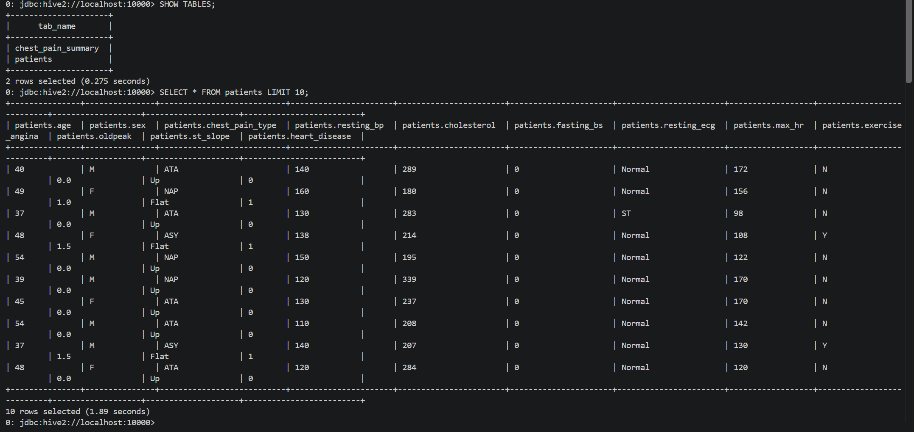
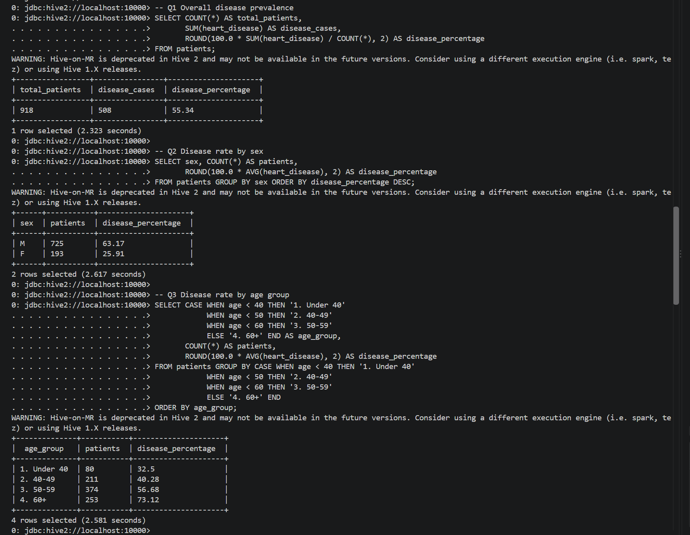
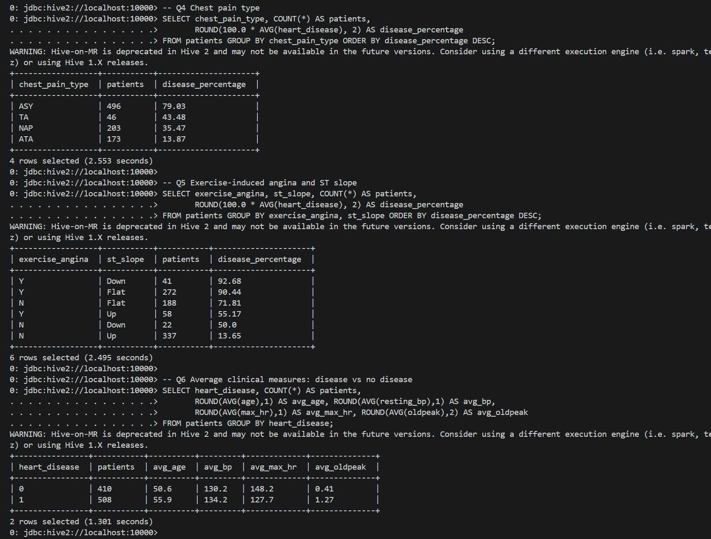
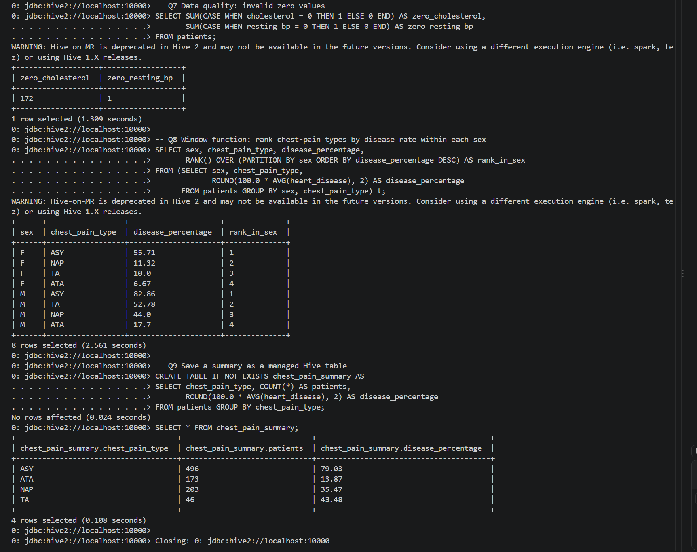

# Healthcare Heart Disease Analytics – Hive on Docker

Big data analysis of a heart disease dataset (918 patients) using **Apache Hive 2.3.2** and **Hadoop 2.7.4** running in Docker. The CSV is loaded into HDFS, exposed as a Hive external table, and analysed with HiveQL through Beeline using `docker exec`.

## Project Files

| File | Description |
|------|-------------|
| `docker-compose.yml` | Hadoop + Hive container stack |
| `setup.ps1` | One-command setup: start containers, load CSV to HDFS, run queries |
| `hive_queries.sql` | HiveQL: database, external table, 9 analysis queries |
| `capstone_project.ipynb` | Python notebook (analysis / prediction) |
| `Healthcare_Analytics_Report` | Written project report |
| `Healthcare_Disease_Prediction` | Project document |

## Architecture

| Container     | Role |
|---------------|------|
| `namenode`    | HDFS master, stores the CSV metadata |
| `datanode`    | HDFS worker, stores the data blocks |
| `hive-server` | HiveServer2 (JDBC on port 10000), queried with Beeline |

## Dataset

918 patients, 12 columns:
`age, sex, chest_pain_type, resting_bp, cholesterol, fasting_bs, resting_ecg, max_hr, exercise_angina, oldpeak, st_slope, heart_disease` (target: 1 = disease, 0 = normal).

## Prerequisites

- Docker Desktop (running)
- VS Code (or any terminal) with PowerShell
- Git

## How to Run

```powershell
git clone https://github.com/maulikcmr05/GUVI-Project.git
cd GUVI-Project
.\setup.ps1 -CsvFile ".\heart.csv"
```

> If PowerShell blocks the script: `Set-ExecutionPolicy -Scope Process Bypass`

### Or run the steps manually

```powershell
# 1. Start the cluster
docker compose up -d

# 2. Copy the CSV into HDFS
docker cp heart.csv namenode:/tmp/heart.csv
docker exec namenode hdfs dfs -mkdir -p /user/hive/healthcare
docker exec namenode hdfs dfs -put -f /tmp/heart.csv /user/hive/healthcare/

# 3. Copy and run the Hive queries
docker cp hive_queries.sql hive-server:/tmp/hive_queries.sql
docker exec -it hive-server beeline -u jdbc:hive2://localhost:10000 -f /tmp/hive_queries.sql
```

The HDFS folder must match the `LOCATION` of the external table in `hive_queries.sql`.

## Analysis and Key Findings

| # | Query | Result |
|---|-------|--------|
| Q1 | Overall prevalence | 508 of 918 patients (**55.34%**) have heart disease |
| Q2 | By sex | Male **63.17%** (725 patients) vs Female **25.91%** (193) |
| Q3 | By age group | Under 40: 32.5% → 40-49: 40.28% → 50-59: 56.68% → 60+: **73.12%** |
| Q4 | By chest pain type | ASY **79.03%**, TA 43.48%, NAP 35.47%, ATA 13.87% |
| Q5 | Exercise angina + ST slope | Angina = Y with Down slope: **92.68%**; N with Up slope: 13.65% |
| Q6 | Averages, disease vs none | Age 55.9 vs 50.6; max HR 127.7 vs 148.2; oldpeak 1.27 vs 0.41 |
| Q7 | Data quality | 172 rows with cholesterol = 0, 1 row with resting_bp = 0 |
| Q8 | Window function | `RANK()` of chest pain types within each sex (ASY ranks 1st for both) |
| Q9 | Managed table | `chest_pain_summary` created from a `GROUP BY` aggregation |

**Takeaways**
- Disease risk rises steadily with age and is much higher in males in this dataset.
- Asymptomatic (ASY) chest pain has the highest disease rate, so absence of pain symptoms is not reassuring.
- Exercise-induced angina combined with a flat or downward ST slope is a strong indicator.
- Patients with disease have lower maximum heart rate and higher oldpeak on average.
- 172 zero cholesterol values are invalid readings and should be cleaned or imputed before modelling.

## Output Screenshots

<!-- Save your terminal screenshots in a screenshots/ folder and keep these links -->





## Troubleshooting

- **Container not found**: run `docker ps` and update the names at the top of `setup.ps1`.
- **Beeline connection refused**: HiveServer2 takes about a minute to start; wait and retry.
- **Table returns no rows**: the CSV is not in the table's `LOCATION` folder in HDFS.
- **SLF4J / Hive-on-MR warnings**: harmless. Hive 2 prefers Spark or Tez, but MapReduce works.
- **`docker exec -it` error in scripts or CI**: remove `-it`.

## Technologies

Docker, Hadoop (HDFS), Apache Hive, HiveQL, Beeline, Python (Jupyter), VS Code

## Author

Maulik – [GitHub](https://github.com/maulikcmr05)
